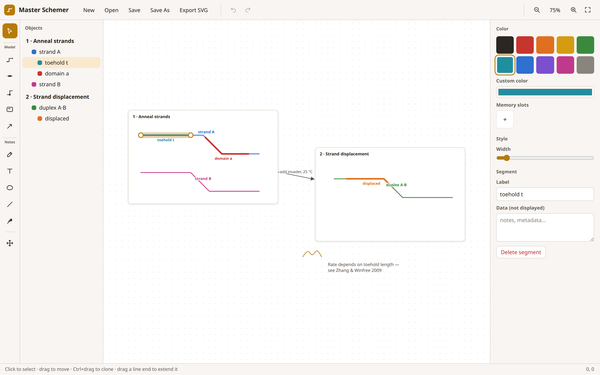

# Master Schemer

A lightweight semantic scheme editor — a drawing canvas where lines, segments,
cards, and arrows are tracked objects with labels and colors, not just ink.
Built for illustrating processes and relationships between objects: reaction
schemes, protocols, conceptual flows.



## Model tools (tracked objects)

| Tool | Key | What it does |
|---|---|---|
| Select | `V` | Click to select, drag to move (multi-selections too), marquee on empty space, double-click to edit text. `Ctrl`+drag clones. Drag a line's end dot to keep laying down line. Drag a selected object's label to reposition it. Dragging a selected segment moves its whole line. Cards, rectangles, and ellipses show corner handles to resize. |
| Line | `L` | Drag to draw a snaking path — horizontal, vertical, and 45° runs at **half-grid** resolution; turns commit corners automatically. Start on an existing line's end to extend it. |
| Segment | `S` | Press on a line and drag along it to mark a colored, labelled sub-segment. Snaps at half-grid resolution; a selected segment's end dots are draggable. |
| Edit line | `E` | Click a line, then drag its square vertex handles to reshape the path. Click anywhere on the selected line to **insert a new vertex** there. |
| Card | `C` | Drag to frame a section — a white sub-canvas card. Cards move by their border/corners only (so their contents stay clickable) and carry their contents with them. |
| Connect | `A` | Drag from one card to another to draw a labelled arrow between them. |

Select two lines whose ends meet on the same grid point and press **Join
lines** in the panel to fuse them into one object.

**Groups** (`Ctrl+G` / `Ctrl+Shift+G` or the panel buttons) bundle any
selection into a named group: clicking one member selects them all, the
sidebar nests members under the group's (renameable) name, and clones land in
a fresh group. Groups **nest** — group whole groups together into
supergroups, to any depth; ungrouping a supergroup releases it back into its
constituent subgroups rather than scattering everything.

**Links** join two selected objects (or segments, or two whole groups) into a
filled area spanning between them — select exactly two things and press
**Link** in the panel. The fill colour and opacity are yours to set, and the
shape re-flows automatically as either end moves.

## Annotation tools (not tracked)

| Tool | Key | What it does |
|---|---|---|
| Freehand | `D` | Unsnapped ink for quick annotations. |
| Note | `T` | Click to place a text note — or **drag a box** to set the width the text wraps at. Wrap math in `$…$` for LaTeX (KaTeX, offline; labels support it too). |
| Ellipse | `O` | Drag to draw a circle/ellipse; hold **Shift** for a perfect circle. Fill it from the panel. |
| Rectangle | `B` | Drag to draw a rectangle; hold **Shift** for a square. Round its corners and fill it from the panel. |
| Free line | `N` | A straight line annotation. |
| Free arrow | `R` | Same, with an arrowhead. |
| Pan | `H` / Space / middle-drag | Move around the canvas. Mouse wheel zooms at the cursor. |

Shape and line annotations snap to the half-grid; toggle **Snap** in the
status bar to draw freely. Any annotation can be **promoted to a tracked
object** from the panel — it then appears in the object sidebar with the rest.

The status bar also carries **Data** (show every object's hidden data in a box
beside it) and **Data on hover** (reveal one object's data as you point at it).

## Sidebar, panel, palette

- The **Objects sidebar** lists every tracked object — user groups first,
  then grouped under the card that contains them; segments nest under their
  line. Click to select, double-click to rename (segments and groups too).
- The **Library** below it stores reusable assets across sessions: select
  something and hit **＋ Save selection**, click an asset to stamp a copy
  onto the canvas. **Export**/**Import** move the library between machines
  as a plain JSON file.
- The **properties panel** edits label, color, width (slider + numeric
  input), fill (for rectangles/ellipses), line style (solid/dashed/dotted),
  line ends (rounded/flat/square), end caps (arrow, **harpoon** — a
  seamless half-arrow you can flip to either side — barb, square, circle),
  rectangle corner radius, a hidden **Data** notes field per object, canvas
  **background colour** (when nothing is selected), and **Arrange**: z-order
  (Front/Raise/Lower/Back), rotate 90°/flip, and alignment
  (left/center/right/top/middle/bottom) for multi-selections.
- **Labels** can be hidden, dragged to a custom position, and **shared**:
  attach elements to a shared label slot and renaming one renames them all.
- **Color**: 10 fixed swatches, an inline hue/saturation picker with hex
  input, and **memory slots**. Objects colored from a slot stay linked to
  it — edit the slot and every user recolors instantly. Removing a slot
  freezes its current color into its users.
- Line width goes up to one full grid unit, so two adjacent lines tile the
  lattice with no gap.

`Ctrl+Z`/`Ctrl+Shift+Z` undo/redo, `Delete` removes, arrow keys nudge by one
grid cell, `Ctrl+G` groups, `1` fits the scheme in view, `0` resets zoom.

Documents autosave locally. **Save** / **Save As** (`Ctrl+S` /
`Ctrl+Shift+S`) write a `.schemer.json` file — through native file dialogs in
the desktop app — **Open** loads one, **Export SVG** produces a standalone
vector file, and **Export CSV** dumps every object (or just the selection —
a selected card exports its contents) with its type, name, group, card,
color, and hidden data. Notes and labels using `$math$` render via KaTeX both
in-app and in exported SVGs — the export bakes the KaTeX stylesheet and fonts
in as data URIs, so the file renders math anywhere with nothing alongside it.

Each session opens on a fresh blank canvas (work is still autosaved locally
between edits; use **Open** to reload a saved `.schemer.json`).

## Running

No build step, no dependencies. Serve the folder and open it:

```bash
python3 -m http.server 8123   # then http://localhost:8123
```

(Any static server works; opening `index.html` directly also works in
browsers that allow ES modules from `file://`.)

## Desktop app (Linux / macOS / Windows)

The desktop build is a thin [Tauri](https://tauri.app) wrapper around the same
files. With Rust and the Tauri CLI installed:

```bash
cargo install tauri-cli --locked
cargo tauri build        # from the repo root; bundles for the host platform
```

Tagged releases (`v*`) build all three platforms automatically via GitHub
Actions — see `.github/workflows/release.yml`.

## Development

```bash
node --test test/geom.test.mjs   # geometry unit tests
```

Source layout (vanilla ES modules, no framework):

- `js/geom.js` — grid snapping, 8-direction path logic, arc-length math, path merging
- `js/model.js` — document model, palette slots, selection, undo history, z-order, persistence
- `js/render.js` — SVG rendering (caps, dashes, KaTeX notes) + SVG export
- `js/tools.js` — tool state machines
- `js/app.js` — shell: event routing, sidebar, panel, keyboard, file ops
- `vendor/katex/` — vendored KaTeX for offline math

`PRODUCT.md` and `DESIGN.md` capture the product intent and visual system.
